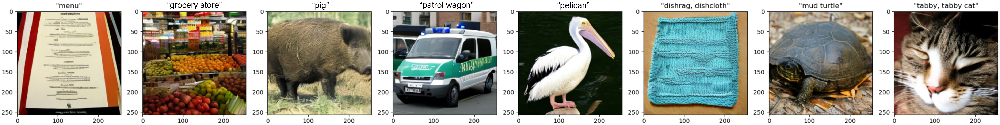
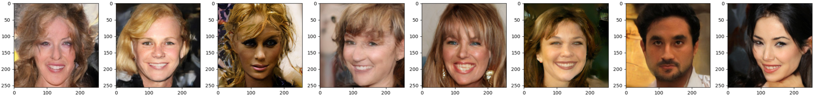

# jax-flow
Implementation of flow-matching models in JAX [1] [2]. These are basically diffusion models, and we base the backbone off of the Diffusion Transformer (DiT) model. See [here for DiT implemenation](https://github.com/kvfrans/jax-diffusion-transformer).

[1] [Liu et al 2022, Flow Straight and Fast: Learning to Generate and Transfer Data with Rectified Flow](https://arxiv.org/abs/2209.03003)

[2] [Lipman et al 2022, Flow Matching for Generative Modeling](https://arxiv.org/abs/2210.02747)

We can sample from the noising path between `x0 (noise)` and `x1 (data)` by linear interpolation:
```
x_t = (1-t) * x_0 + t * x_1
```
and the objective is to match the normalized velocity:
```
v_theta(x_t) <- (x_1 - x_0).
```
During denoising, the flow-matching model defines an ODE. We can evaluate the solution to the ODE with Euler sampling, e.g. 
```
x = noise
for i in range(N):
    dt = 1 / N
    x = x + v_theta(x) * dt
```

## Installation
First, clone the repo. Then you can install the conda environment using `conda env create -f environment.yml`. You will need to compile the TFDS datasets for `imagenet2012` or `celebahq`, see [this repo](https://github.com/kvfrans/tfds_builders).

## Usage
To run training code, use `train_flow.py`. Evalute FID on a trained model with `eval_fid.py`.

Here are some useful to commands to replicate results. These use the `DiT-B` settings, with patch size of `2` for latent diffusion and `8` for pixels.
```
# Diffusion on Imagenet256 (w/ Stable Diffusion VAE)
python train_flow.py --dataset_name imagenet256 --wandb.name DiT-B --model.depth 12 --model.hidden_size 768 --model.patch_size 2 --model.num_heads 16 --model.mlp_ratio 4 --batch_size 512

# Diffusion on CelebaHQ256 (w/ Stable Diffusion VAE)
python train_flow.py --dataset_name celebahq256 --wandb.name DiT-B-CelebA --model.depth 12 --model.hidden_size 768 --model.patch_size 2 --model.num_heads 16 --model.mlp_ratio 4 --batch_size 512

# Diffusion on CelebaHQ256 (Pixels)
python train_flow.py --dataset_name celebahq256 --wandb.name DiT-B-CelebAPixel --model.depth 12 --model.hidden_size 768 --model.patch_size 8 --model.num_heads 16 --model.mlp_ratio 4 --batch_size 512 --use_stable_vae 0
```

The following numbers compares flow-matching with diffusion under the same network structure, along with to a reference diffusion implementation. 500 denoising steps are used.

| Model                          |FID 50K (ours)| FID 50K ([our diffusion](https://github.com/kvfrans/jax-diffusion-transformer)) | FID 50K (reference paper) |
| :----------------------------- | :------: | :-------: | -------: |
| DiT-B Imagenet256, no CFG      |     42.0     |   52.5   | 43.47  ([DiT](https://arxiv.org/pdf/2212.09748))|
| DiT-XL Imagenet256, no CFG     |     N/A     |    N/A   | 9.62  ([DiT](https://arxiv.org/pdf/2212.09748))|
| DiT-B Imagenet256, CFG=4       |  15.4    |   16.34   | N/A          |
| DiT-B CelebAHQ256              |   28.9   |   28.35  | 5.11  ([LDM](https://arxiv.org/pdf/2112.10752)) |


With flow-matching it's easy to dynamically change the number of denoising steps. Each step is a *deterministic* function. Here is how it affects FID.
### Imagenet256, CFG=4
| Denoising Steps  |FID 50K (ours )
| :----------------| ------: |
| 500              |   15.5   |
| 100              |   17.85  |
| 20               |   17.9   |
| 5                |   29.6   |
| 1                |   229.4  |


### CelebAHQ256
| Denoising Steps  |FID 50K (ours )
| :----------------| ------: |
| 500              |   28.9   |
| 100              |   28.7   |
| 20               |   28.87  |
| 5                |   58.4   |
| 1                |   249.7  |


## Examples

DiT-B Imagenet, CFG=4


DiT-B CelebAHQ256

